# Proyecto Final - Docker & Kubernetes

Aprendiendo el flujo profesional de actualización y gestión de aplicaciones en Kubernetes, utilizando microk8s como entorno de desarrollo local que simula un cluster cloud.

**Alumno:** Kelly Amanda Chiara Flores

**Fecha:** 23 de noviembre de 2025

**Curso:** [Docker & Kubernetes DIACONIA - i-Quattro](https://iquattrogroup.com/course/view.php?id=116)

## Parte 1: Setup del Ambiente

### 1.1 Creación de Maquina Virtual
Recursos necesarios

- VirtualBox
- Imagen ISO de Ubuntu 24.04

Donde la guía de creación de la maquina virtual, la encuentras [aqui](./creacion-maquina-virtual/README.md)

- Verificamos el sistema operativo
```bash
lsb_release -a
```
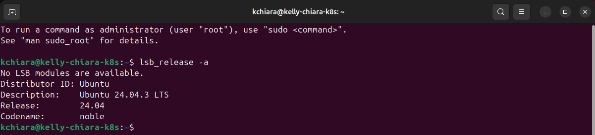

- Verificamos la memoria
```bash
free -h
```
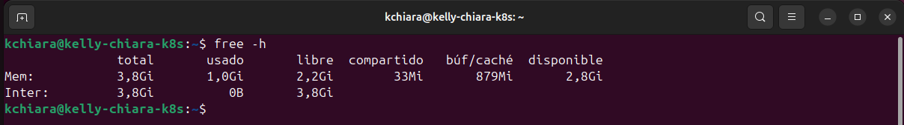

- Verificamos número de CPU Cores
```bash
lscpu | grep 'CPU(s):'
```
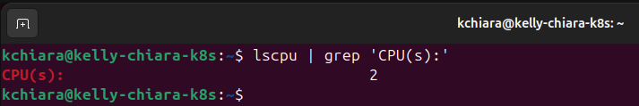

### 1.2 Instalación microk8s
- Actualizamos el sistema
```bash
sudo apt update && sudo apt upgrade -y
```
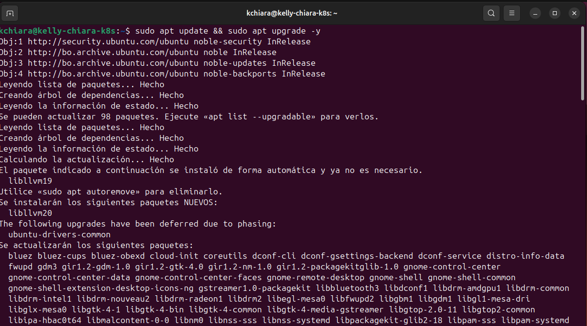

- Instalar microk8s
```bash
sudo snap install microk8s --classic
```
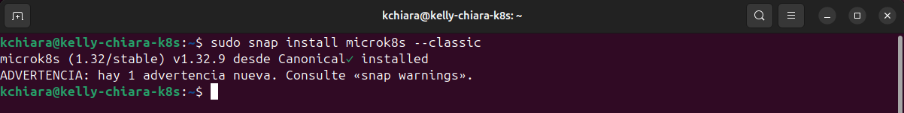

- Agregar usuario al grupo
```bash
sudo usermod -a -G microk8s $USER
sudo chown -f -R $USER ~/.kube
newgrp microk8s
```
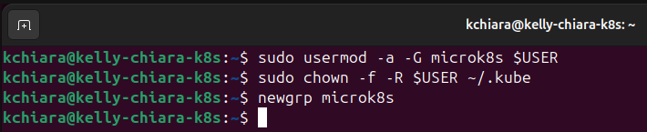

- Verificación de la instalación
```bash
microk8s status --wait-ready
```
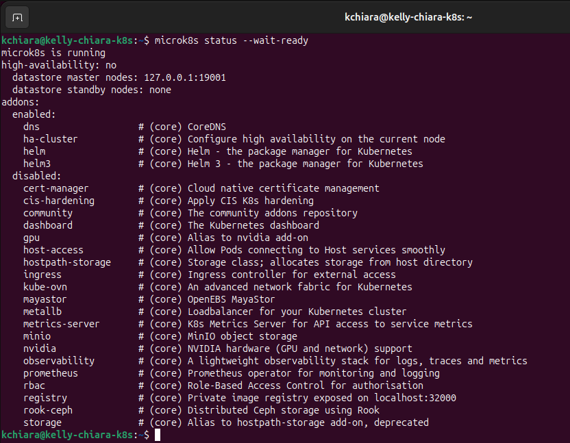

- Creación de alias
```bash
echo "alias kubectl='microk8s kubectl'" >> ~/.bashrc
source ~/.bashrc
```
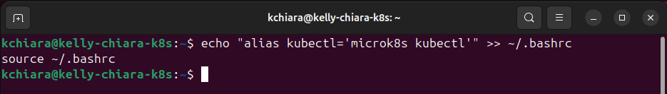

### 1.3 Habilitar Addons
- Habilitar addons necesarios
```bash
microk8s enable dns
microk8s enable storage
microk8s enable ingress
microk8s enable metrics-server
```
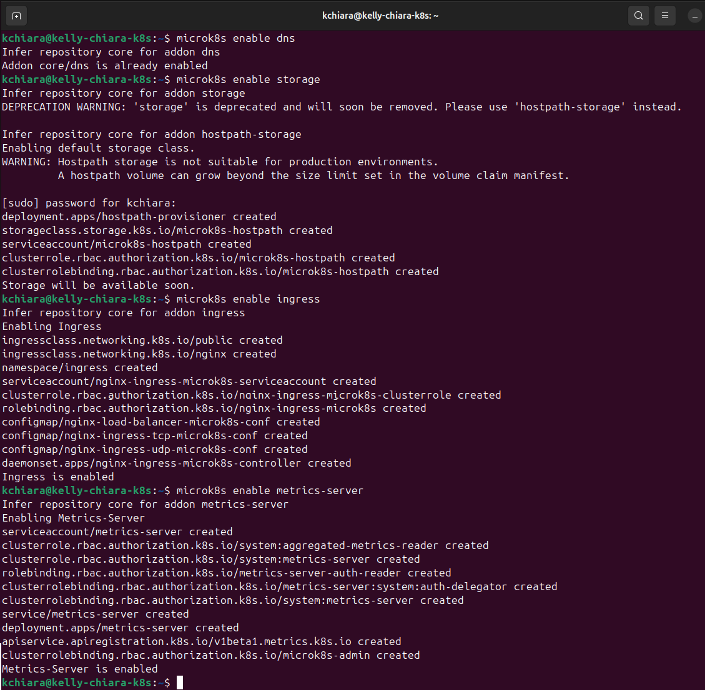

- Habilitar MetalB (reemplaza el ranfo de las IPs de la red local)
```bash
microk8s enable metallb:10.0.0.100-10.0.0.110
```
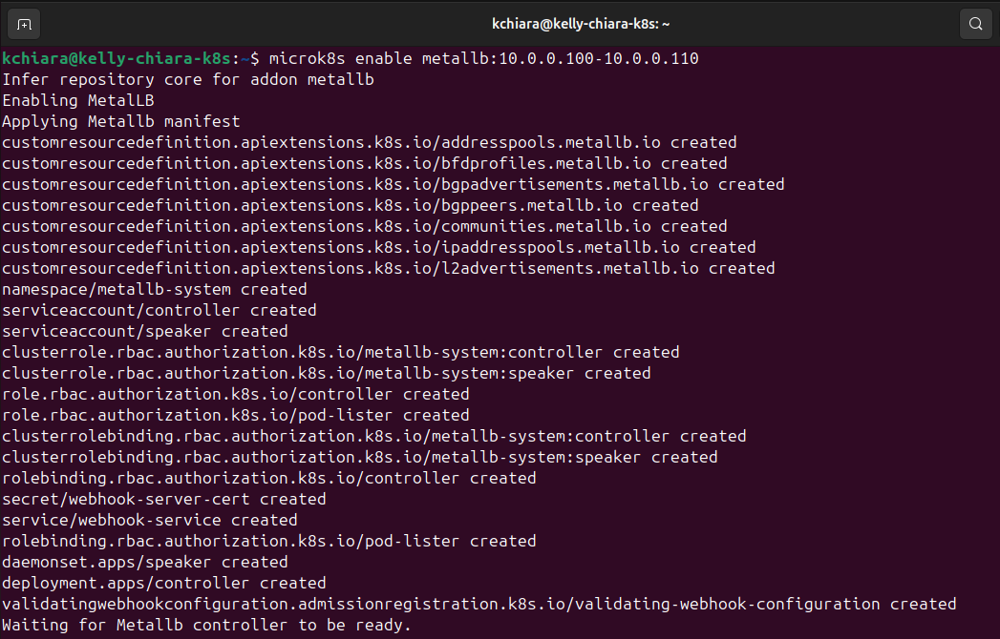

- Verificación que todos estén activos
```bash
microk8s status
```
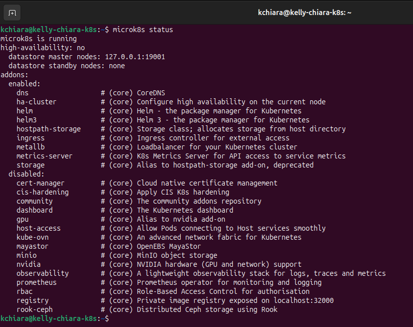

### 1.4 Instalación Git y Docker
- Instalación Git
```bash
sudo apt install git -y
```
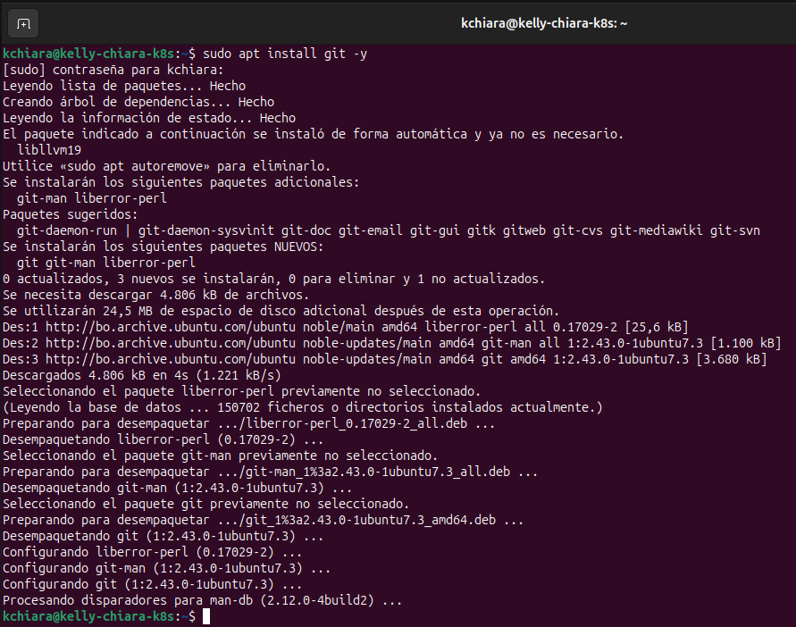

- Instalación Docker
```bash
sudo apt install docker.io -y
sudo usermod -aG docker $USER
newgrp docker
```
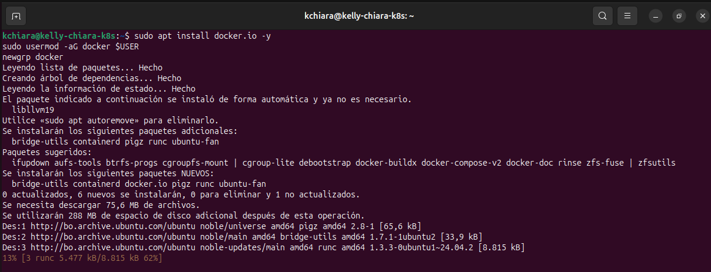

- Verificación instalación docker
```bash
docker --version
docker run hello-world
```


- Login en Docker Hub
```bash
docker login
```
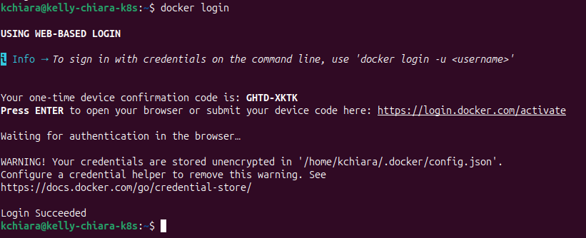
