# Proyecto Final - Docker & Kubernetes

Aprendiendo el flujo profesional de actualización y gestión de aplicaciones en Kubernetes, utilizando microk8s como entorno de desarrollo local que simula un cluster cloud.

**Alumno:** Kelly Amanda Chiara Flores

**Fecha:** 23 de noviembre de 2025

**Curso:** [Docker & Kubernetes DIACONIA - i-Quattro](https://iquattrogroup.com/course/view.php?id=116)

## Parte 1: Setup del Ambiente

### 1.1 Creación de Maquina Virtual
Recursos necesarios

- VirtualBox
- Imagen ISO de Ubuntu 24.04

Donde la guía de creación de la maquina virtual, la encuentras [aqui](./creacion-maquina-virtual/README.md)

- Verificamos el sistema operativo
```bash
lsb_release -a
```


- Verificamos la memoria
```bash
free -h
```


- Verificamos número de CPU Cores
```bash
lscpu | grep 'CPU(s):'
```


### 1.2 Instalación microk8s
- Actualizamos el sistema
```bash
sudo apt update && sudo apt upgrade -y
```


- Instalar microk8s
```bash
sudo snap install microk8s --classic
```


- Agregar usuario al grupo
```bash
sudo usermod -a -G microk8s $USER
sudo chown -f -R $USER ~/.kube
newgrp microk8s
```


- Verificación de la instalación
```bash
microk8s status --wait-ready
```


- Creación de alias
```bash
echo "alias kubectl='microk8s kubectl'" >> ~/.bashrc
source ~/.bashrc
```


### 1.3 Habilitar Addons
- Habilitar addons necesarios
```bash
microk8s enable dns
microk8s enable storage
microk8s enable ingress
microk8s enable metrics-server
```


- Habilitar MetalB (reemplaza el ranfo de las IPs de la red local)
```bash
microk8s enable metallb:10.0.0.100-10.0.0.110
```


- Verificación que todos estén activos
```bash
microk8s status
```


### 1.4 Instalación Git y Docker
- Instalación Git
```bash
sudo apt install git -y
```


- Instalación Docker
```bash
sudo apt install docker.io -y
sudo usermod -aG docker $USER
newgrp docker
```


- Verificación instalación docker
```bash
docker --version
docker run hello-world
```


- Login en Docker Hub
```bash
docker login
```


### 1.5 Obtener y Desplegar proyecto integrador v2.0
- Descargamos el zip, lo descomprimimos y empezamos a inicializarlo

- Seguimos la guía adjunta [DEPLOYMENT_GUIDE_MICROK8S.md](./proyecto-integrador-docker-k8s/k8s/DEPLOYMENT_GUIDE_MICROK8S.md)

- Verificación microk8s
```bash
microk8s status
```
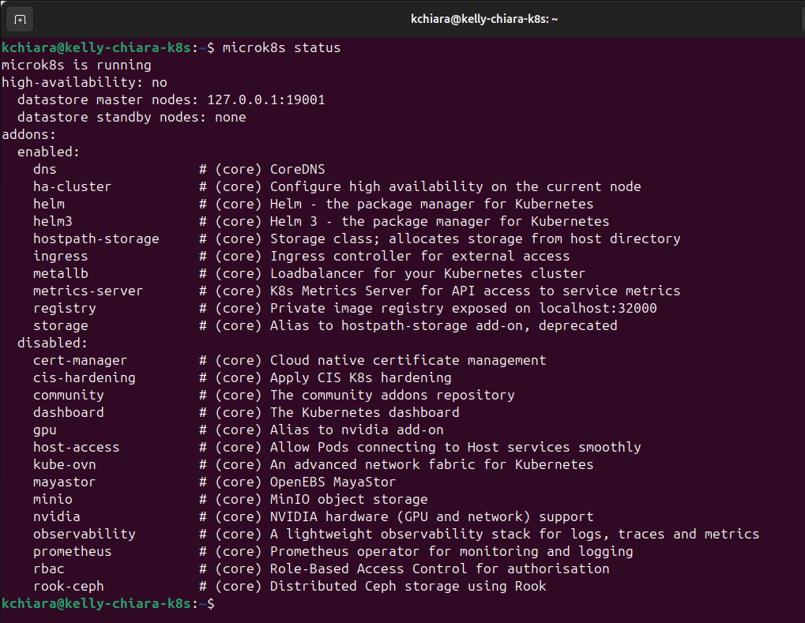

- Verificación de recursos desplegados
```bash
kubectl get all -n proyecto-integrador
```
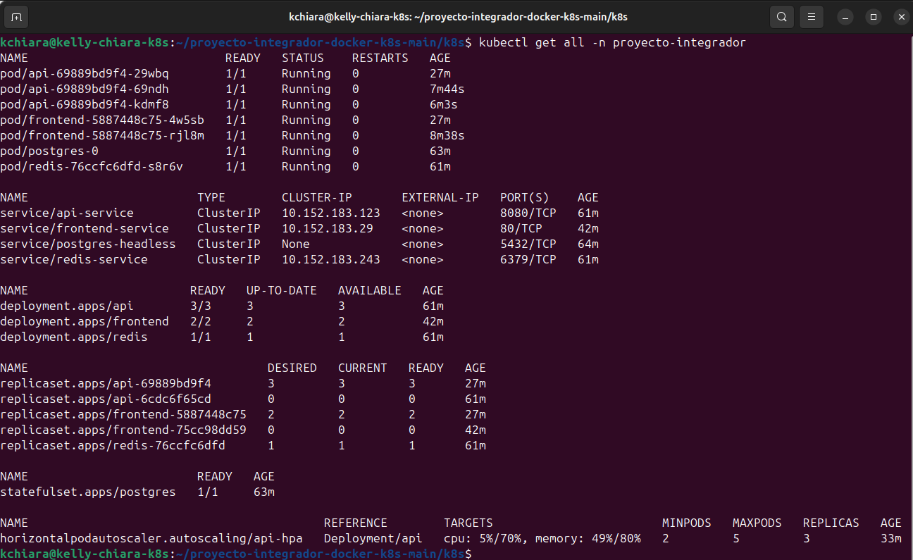

- Vista frontend desde la web con la ip expuesta


- Vista backend desde la web con la ip expuesta

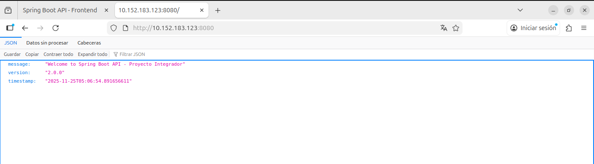

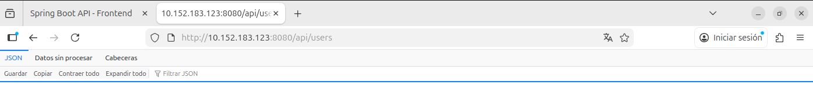

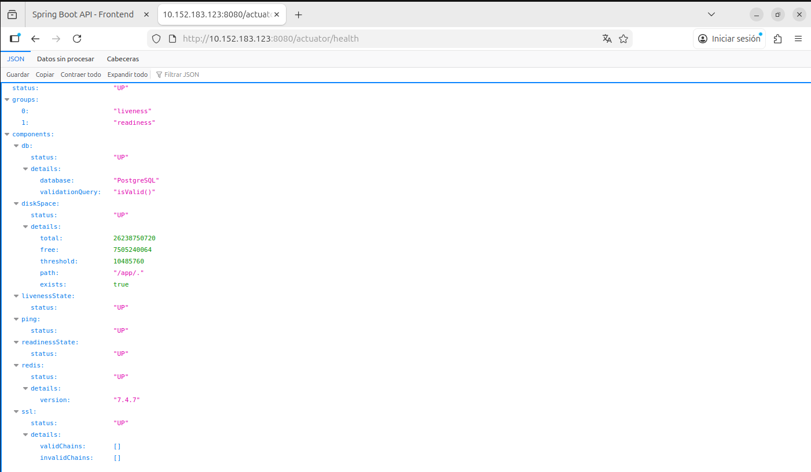

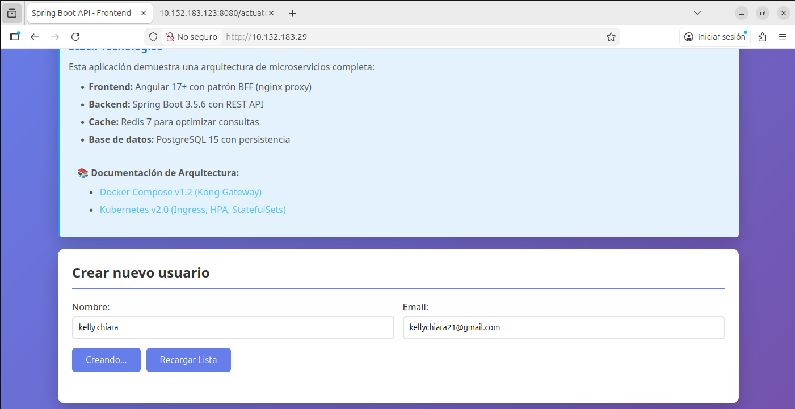

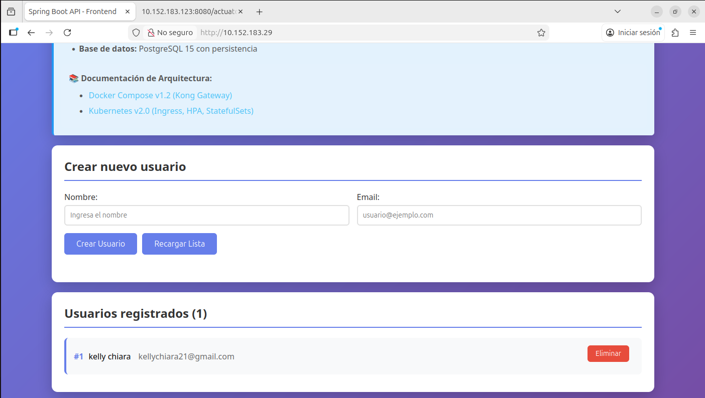

## Parte 2: Iteración v2.1 - Modificar Backend

- Generación de un nuevo Endpoint

Agregamos el siguiente codigo, en el archivo [GreetingController.java](./proyecto-integrador-docker-k8s/src/main/java/dev/alefiengo/api/controller/GreetingController.java)

```bash
@GetMapping("/api/info")
public ResponseEntity<Map<String, Object>> getInfo() {
    Map<String, Object> info = new HashMap<>();
    info.put("alumno", "Kelly Amanda Chiara Flores");
    info.put("version", "v2.1");
    info.put("curso", "Docker & Kubernetes - i-Quattro");
    info.put("timestamp", LocalDateTime.now().toString());
    info.put("hostname", System.getenv("HOSTNAME"));
    return ResponseEntity.ok(info);
}
```
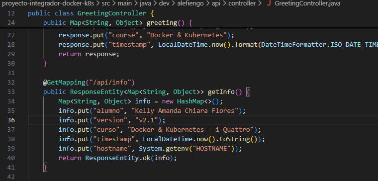

- Push a Docker Hub
```bash
docker push kellychiara/springboot-api:v2.1
```

[kellychiara/springboot-api](https://hub.docker.com/r/kellychiara/springboot-api/tags)

- Actualizamos [api-deployment.yaml](./proyecto-integrador-docker-k8s/k8s/05-backend/api-deployment.yaml)

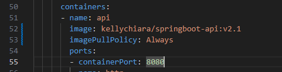

- Aplicación de cambios
```bash
kubectl apply -f k8s/05-backend/api-deployment.yaml
kubectl rollout status deployment/api -n proyecto-integrador
kubectl get pods -n proyecto-integrador -w
```
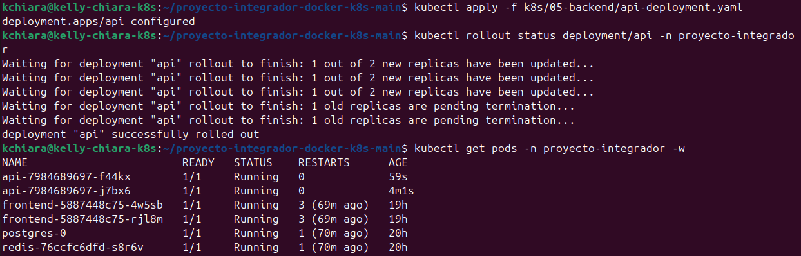

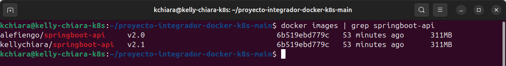

- **Verificación de funcionamiento**
```bash
kubectl port-forward -n proyecto-integrador svc/api-service 8080:8080

curl http://localhost:8080/api/info
```
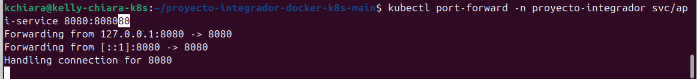

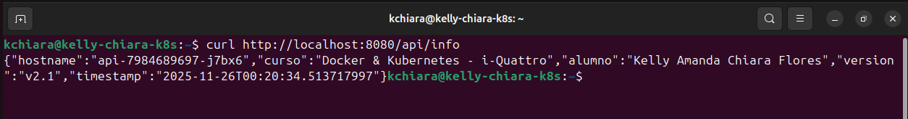

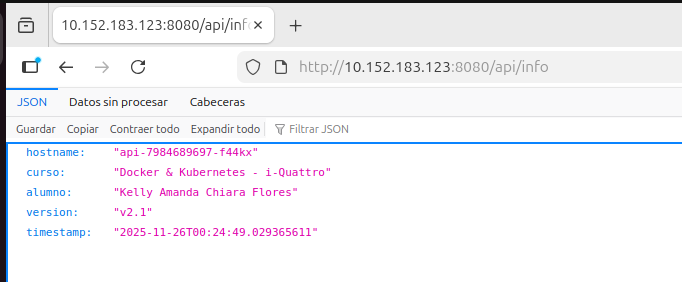

## Parte 3: Modificación Frontend

- Modificar frontend Angular

Actualizamos el archivo [app.component.html](./proyecto-integrador-docker-k8s/frontend/src/app/app.component.html)

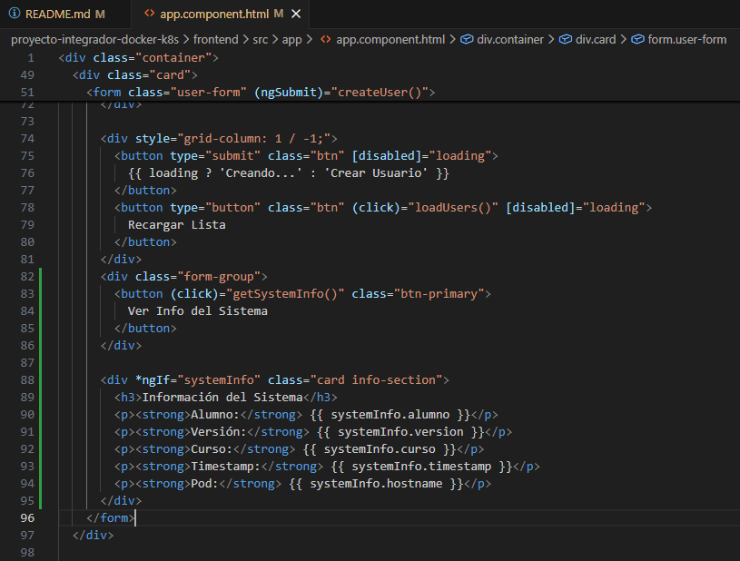

Actualizamos el archivo [app.component.ts](./proyecto-integrador-docker-k8s/frontend/src/app/app.component.ts)

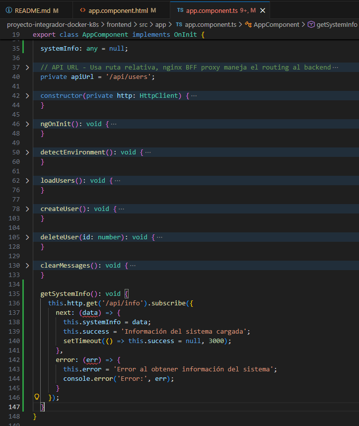

- Build Imagen Frontent v2.2
```bash
cd frontend
docker build -t kellychiara/angular-frontend:v2.2 .

docker push kellychiara/angular-frontend:v2.2
```

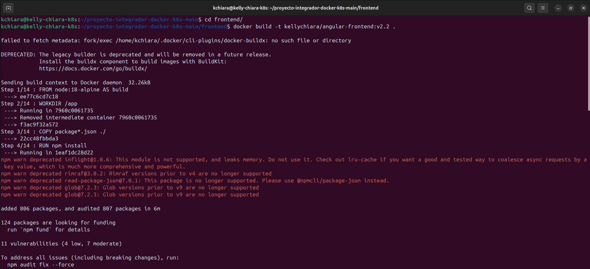

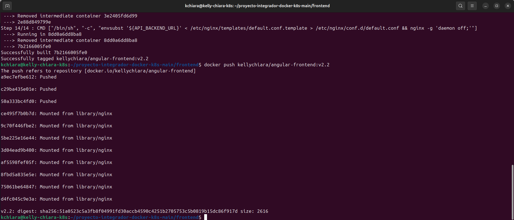

## **Link de la imagen** [kellychiara/angular-frontend](https://hub.docker.com/r/kellychiara/angular-frontend/tags)

- Actualizar deployment

Modificamos el archivo [frontend-deployment.yaml](./proyecto-integrador-docker-k8s/k8s/06-frontend/frontend-deployment.yaml)

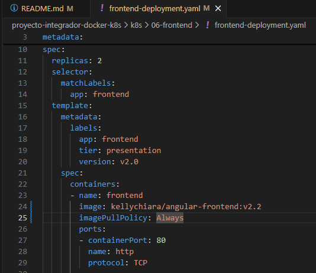

- Aplicamos los cambios
```bash
kubectl apply -f k8s/06-frontend/frontend-deployment.yaml

kubectl rollout status deployment/frontend -n proyecto-integrador

kubectl get pods -n proyecto-integrador -l app=frontend -w
```

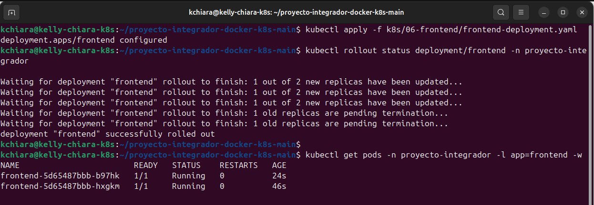

- Verificación del funcionamiento

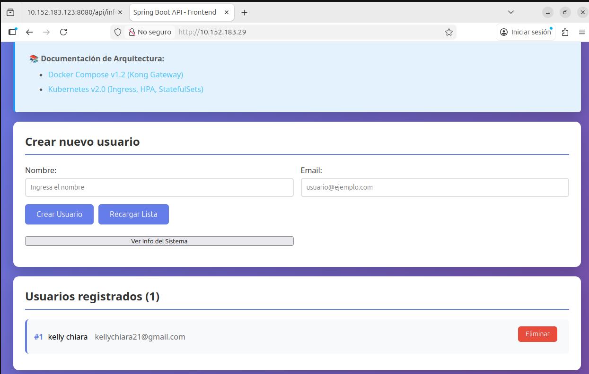

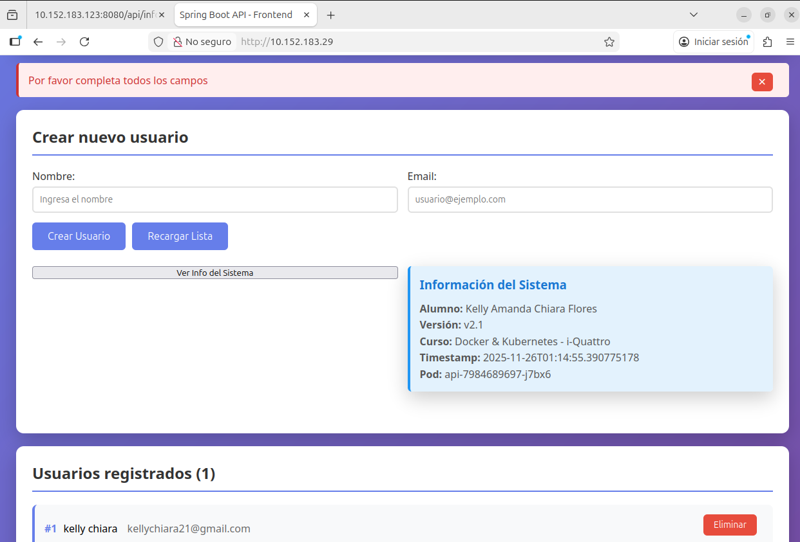

## Parte 4: Gestión de versiones con Rollout

- Ver historial de Rollouts
```bash
kubectl rollout history deployment/api -n proyecto-integrador

kubectl rollout history deployment/frontend -n proyecto-integrador
```
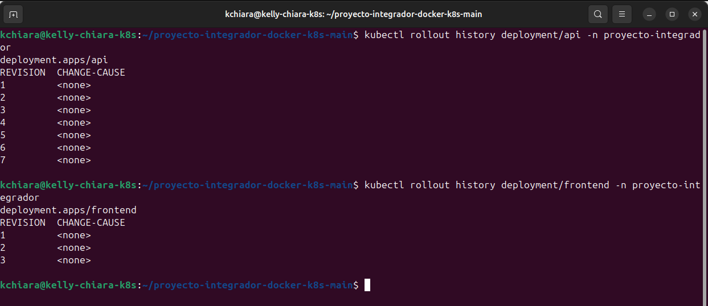

- Hacer Rollback a versión anterior
```bash
kubectl rollout undo deployment/api -n proyecto-integrador

kubectl rollout status deployment/api -n proyecto-integrador

curl http://10.152.183.123:/api/info
```

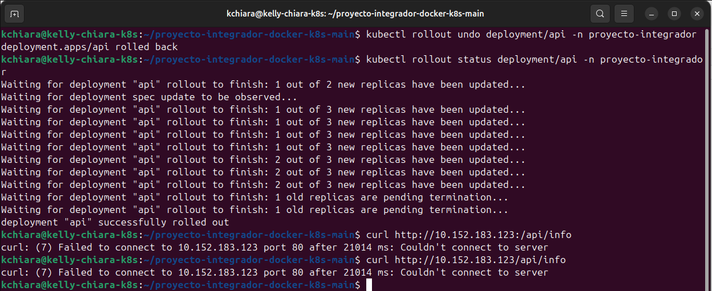

- Volver a la versión 2.1
```bash
kubectl rollout history deployment/api -n proyecto-integrador

kubectl rollout undo deployment/api --to-revision=7 -n proyecto-integrador

curl http://10.152.183.123:/api/info
```

> ### En el caso de revisión=7 ya que es la ultima generada que corresponde a la versión 2.1

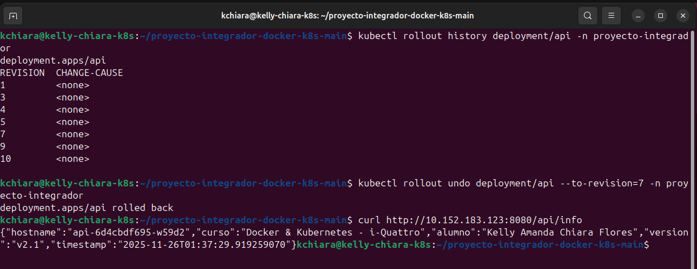

- Forzar recreación de Pods
```bash
kubectl rollout restart deployment/api -n proyecto-integrador

kubectl get pods -n proyecto-integrador -w
```

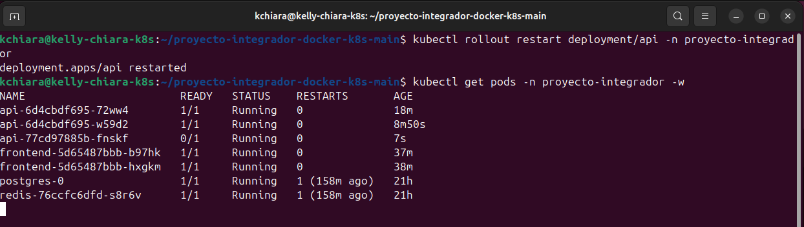

## Parte 5: Acceso Externo via Ingress
- Verificar configuración de ingress
```bash
kubectl get svc -n ingress

kubectl get ipaddresspool -n metallb-system
```

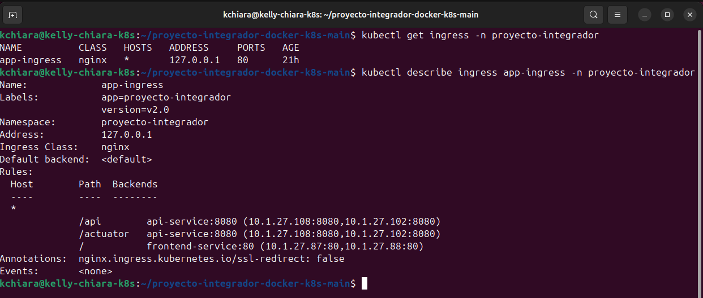

- Verificar MetalLB
```bash
kubectl get svc -n ingress

kubectl get ipaddresspool -n metallb-system
```

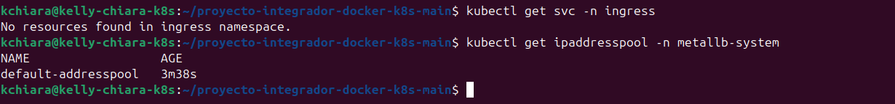

- Probar TODOS los endpoints
```bash
curl http://10.1.27.108:8080/
curl http://10.1.27.108:8080/api/users
curl http://10.1.27.108:8080/api/greeting
curl http://10.1.27.108:8080/api/info
curl http://10.1.27.108:8080/actuator/health
```

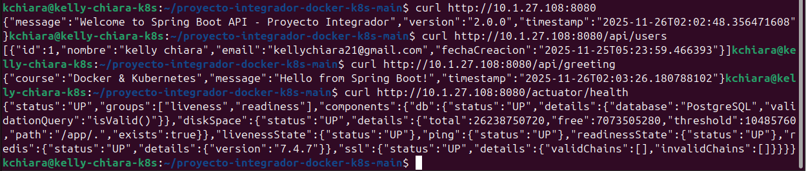

## Validar HPA (Horizontal Pod Autoscaler)
```bash
kubectl run -i --tty load-generator --rm --image=busybox --restart=Never -n proyecto-integrador -- /bin/sh -c "while true; do wget -q -O- http://api-service:8080/api/users; done"
```

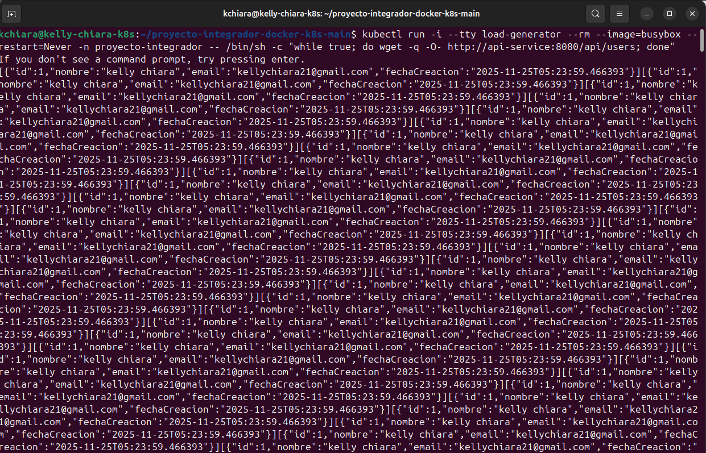

## Verificamos
```bash
kubectl get hpa -n proyecto-integrador -w
```

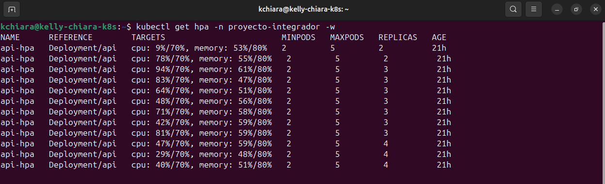

## Pods adicionales
```bash
kubectl get pods -n proyecto-integrador
```

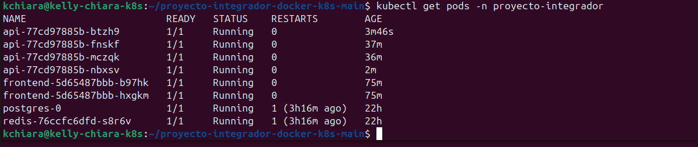

## Proceso
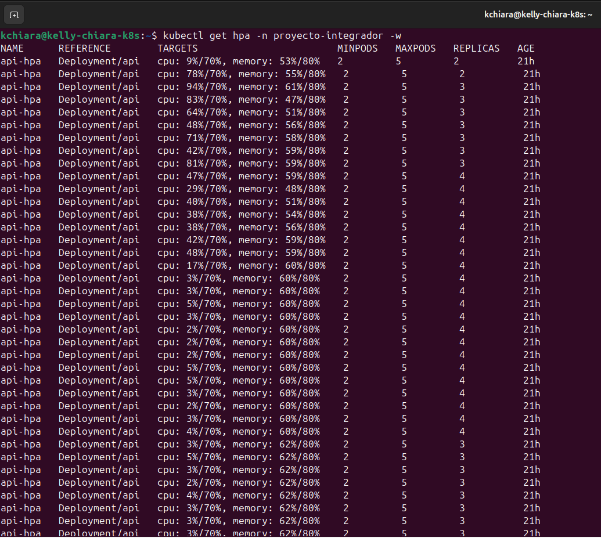